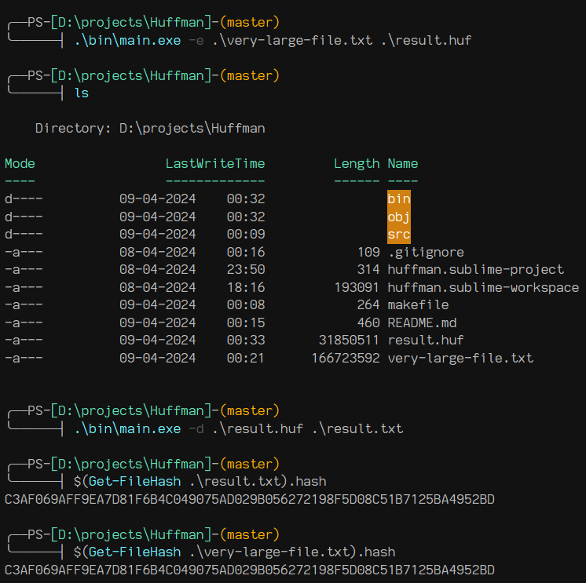

## Huffman Coding
Huffman coding is a compression technique used to encode data more efficiently by assigning shorter codes to more frequent characters and longer codes to less frequent characters.

### Usage

#### Encoding
```bash
./bin/main.exe -e source_file.txt target_file.huf
```

#### Decoding
```bash
./bin/main.exe -d source_file.huf target_file.txt
```



### References

- https://en.wikipedia.org/wiki/Huffman_coding
- https://engineering.purdue.edu/ece264/17au/hw/HW13?alt=huffman (dis is GOAT)
