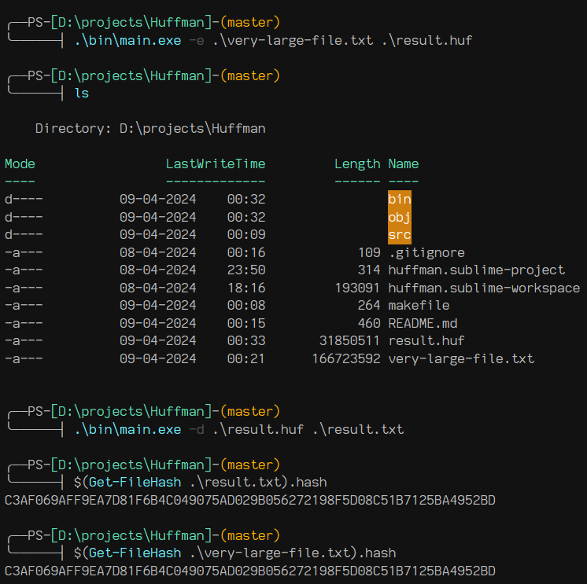

## Huffman Coding

 Huffman coding is a compression technique used to encode data more efficiently by assigning shorter codes to more frequent characters and longer codes to less frequent characters.

### How it works

 - Generate a table that counts the occurrences of each character in the source file.
 - Construct the Huffman tree using optimal merge. This arranges the characters that appear more frequently closer to the root.
 - This is because the path from the root to a character will be the prefix code for that character. So characters that are closer to the root will have shorter codes, while characters that are deeper in the tree will have longer codes.
 - Assign binary codes to each character based on their position in the Huffman tree.
 - The Huffman tree will be stored in the header through postorder traversal, alongside the total number of bits constituting the source data.
 - To decode the encoded data, traverse the Huffman tree according to the encoded binary sequence until a leaf node is reached, which represents a character.

### Example

	

### References

 - [Huffman Coding - Wikipedia](https://en.wikipedia.org/wiki/Huffman_coding)
 - [ECE264: Huffman Coding - Purdue University](https://engineering.purdue.edu/ece264/17au/hw/HW13?alt=huffman) (dis is GOAT)
